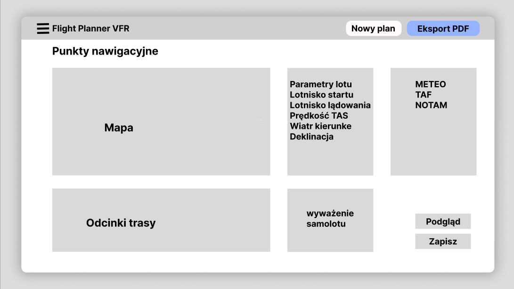

# FPL VFR - Flight Planner for VFR Flights

> Kompleksowa aplikacja webowa do planowania lotów VFR (Visual Flight Rules) z automatycznymi obliczeniami nawigacyjnymi, integracją danych pogodowych i generowaniem dokumentacji lotniczej.

---

## Spis treści

- [Funkcjonalności](#-funkcjonalności)
- [Stack technologiczny](#-stack-technologiczny)
- [Prototyp](#-prototyp)

---

## Funkcjonalności

### 1) Trasa na mapie
- Dodawanie punktów trasy kliknięciem
- Automatyczne wyznaczanie odcinków i kierunków
- Edycja kolejności punktów, usuwanie, podgląd całej trasy

### 2) Automatyczne obliczenia
- TC / MC / WCA / HDG / GS / ETE dla każdego odcinka
- Sumy całkowite: dystans i przewidywany czas lotu
- Szacunkowe zużycie paliwa (przelot, taxi, rezerwy)

### 3) Pogoda w jednej karcie
- METAR i TAF dla lotnisk startu i docelowego
- GAMET (IMGW) – wiatr dla wybranej warstwy/pułapu
- Ostrzeżenia, gdy pogoda nie spełnia założeń VFR

### 4) Komunikaty i informacje lotnicze
- NOTAM dla lotnisk z trasy
- AIP – podstawowe dane lotnisk (pasy, długości, orientacja)

### 5) Samolot i wyważenie
- Moduł Weight & Balance: masa pilot/pax, paliwo, bagaż → CG, MTOW
- Profil samolotu zapisywany do późniejszego użycia

### 6) Operacyjny Plan Lotu (PDF)
- Generowanie gotowego OPL z wypełnionymi polami
- Wersja do druku lub zapisu

---

## Stack technologiczny

### Frontend
- **Next.js 14** - App Router, SSR
- **React 18** - Hooks, komponenty
- **TypeScript** - Typowanie
- **Tailwind CSS** - Stylowanie

### Backend
- **NestJS 10** - Modułowa architektura
- **Prisma ORM** - Baza danych
- **PostgreSQL 16** - Relacyjna baza
- **RabbitMQ** - Kolejki wiadomości

---

##  Prototyp

---

##  Autor

Projekt stworzony na potrzeby przedmiotu **ZTPAI**.
